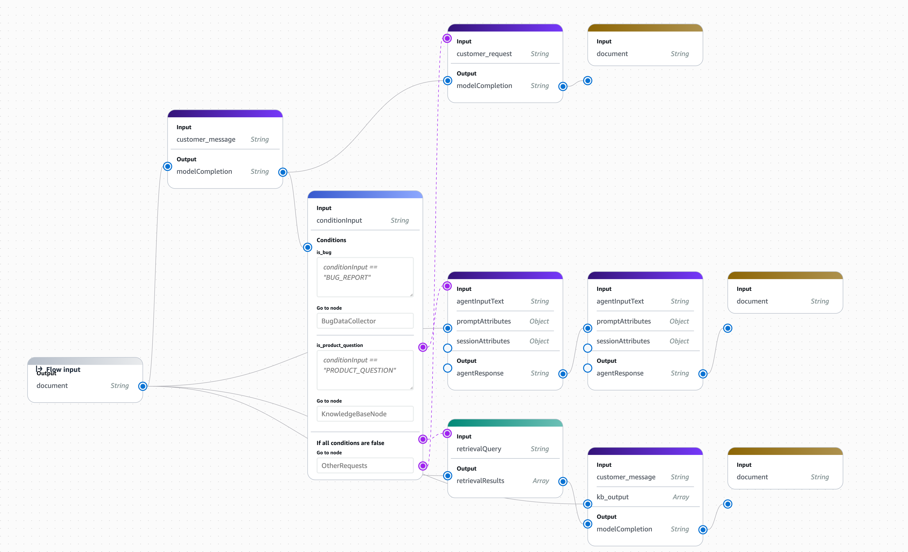

# Customer Support Chatbot with Amazon Bedrock Flows

In this project you will build a customer support chatbot using Amazon Bedrock Flows. The chatbot classifies incoming customer messages and routes them to the appropriate handler:

- **Bug reports** - Collected by an agent and stored in a DynamoDB table via a Lambda tool.
- **Product questions** - Answered using a Knowledge Base with your product documentation.
- **Other requests** - Politely redirected to a human support phone line.

The final flow looks like this:



## Getting Started

### Dependencies

- An AWS account with Amazon Bedrock access enabled.
- AWS CLI configured with appropriate credentials.
- Python 3.9+ with `boto3` installed.
- Access to an Amazon Bedrock model (the solution uses Amazon Nova Premier, but you can use any supported model).

### Project Files

| File | Description |
|------|-------------|
| `create-bug-report.py` | Lambda function that stores bug reports in DynamoDB. Deploy this as an Agent tool. |
| `generate-eval-dataset.py` | Script that runs your flow against a test suite and produces a JSONL file for Bedrock Evaluations. |
| `flow-tests-template.json` | Template for your test suite. Copy this and fill in your own test cases. |
| `solution/` | Reference solution with the complete flow definition, test prompts, and a diagram. |

## Project Instructions

### Step 1: Create a Bug Report Tool

Deploy `create-bug-report.py` as an AWS Lambda function and connect it to a Bedrock Agent as an action group tool. This function:

- Receives a structured bug report (description, steps to reproduce, environment).
- Generates a unique ticket ID.
- Stores the report in a DynamoDB table called `BugReports`.

You will need to:

1. Create a DynamoDB table named `BugReports` with `ticketId` as the partition key.
2. Deploy the Lambda function with permissions to write to that table.
3. Create a Bedrock Agent that uses this Lambda as a tool.

### Step 2: Set Up a Knowledge Base

Create a Bedrock Knowledge Base with product documentation that can answer customer questions. You choose the data source and documents to index.

### Step 3: Build the Bedrock Flow

Create a Bedrock Flow that implements the routing logic:

1. **Classify the input** - Use a Prompt node to classify the customer message as `BUG_REPORT`, `PRODUCT_QUESTION`, or other.
2. **Route with a Condition node** - Branch execution based on the classification result.
3. **Bug report path** - Send bug reports through an Agent node that collects details and creates a ticket using the tool from Step 1.
4. **Product question path** - Query the Knowledge Base from Step 2, then use a Prompt node to summarize the results into a helpful response.
5. **Default path** - Use a Prompt node to politely suggest the customer call a support phone number.

### Step 4: Write Test Prompts

Copy `flow-tests-template.json` to `flow-tests.json` and fill in your own test cases. You should create at least one test per branch (bug report, product question, and other). The template shows the required fields for each test entry.

Set `flowInputNode.nodeName` to the name of the Input node in your flow.

### Step 5: Generate an Evaluation Dataset

Use `generate-eval-dataset.py` to invoke your flow with each test prompt and produce a JSONL dataset for Bedrock Evaluations:

```bash
python generate-eval-dataset.py \
  --tests-json flow-tests.json \
  --flow-id <your-flow-id> \
  --flow-alias-id <your-flow-alias-id>
```

This writes `output_eval_dataset.jsonl`, where each line contains the original prompt, your flow's response, and the reference response.

### Step 6: Run Bedrock Evaluations

1. Upload `output_eval_dataset.jsonl` to an S3 bucket.
2. In the Bedrock console, create an evaluation job using the **LLM-as-a-judge** method with your uploaded dataset.
3. Review the evaluation results to assess how well your flow handles each category of request.

## Testing

You can test your flow manually from the Bedrock console, or use the provided script to run all test cases at once:

```bash
python generate-eval-dataset.py \
  --tests-json flow-tests.json \
  --flow-id <your-flow-id> \
  --flow-alias-id <your-flow-alias-id> \
  --enable-trace
```

The `--enable-trace` flag prints trace events for each invocation, which is useful for debugging routing issues.

### Test Cases

Your test suite should cover all three branches of the flow. Verify that each test is routed to the correct branch and produces a reasonable response.

## Built With

* [Amazon Bedrock Flows](https://docs.aws.amazon.com/bedrock/latest/userguide/flows.html) - Orchestration of the LLM application
* [Amazon Bedrock Agents](https://docs.aws.amazon.com/bedrock/latest/userguide/agents.html) - Tool use for bug report creation
* [Amazon Bedrock Knowledge Bases](https://docs.aws.amazon.com/bedrock/latest/userguide/knowledge-base.html) - RAG for product questions
* [Amazon Bedrock Evaluations](https://docs.aws.amazon.com/bedrock/latest/userguide/evaluation.html) - LLM-as-a-judge evaluation
* [AWS Lambda](https://aws.amazon.com/lambda/) - Bug report tool runtime
* [Amazon DynamoDB](https://aws.amazon.com/dynamodb/) - Bug report storage

## License

[License](../LICENSE.md)
